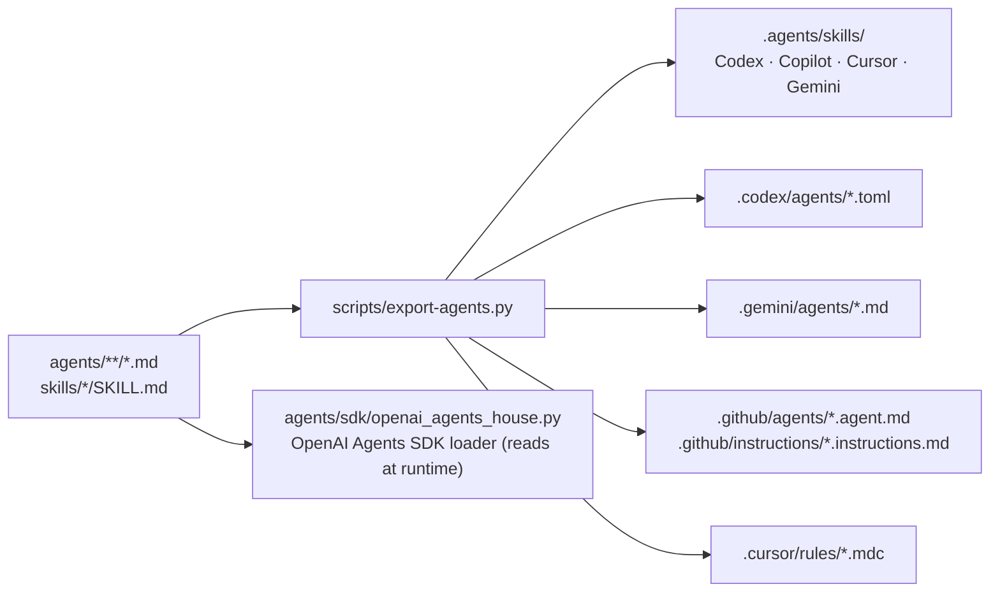

# Running the house outside Claude Code

The rules, gates and agents here are written once and read by more than one
runtime. This page says what each runtime reads, what we generate for it, and
what does not carry over. Checked against official docs on 2026-10-04; links at
the bottom. Anything marked *unconfirmed* was not in an official page.

## Contents

- [What is portable as-is](#what-is-portable-as-is)
- [What we generate](#what-we-generate)
- [Per runtime](#per-runtime)
- [What does not carry over](#what-does-not-carry-over)
- [Sources](#sources)

## What is portable as-is

| File | Read natively by |
|---|---|
| `AGENTS.md` | Codex, GitHub Copilot, Cursor; Gemini CLI with `"context": {"fileName": ["AGENTS.md", "GEMINI.md"]}` in `.gemini/settings.json` |
| `platform/AGENTS.<stack>.md` | every runtime, because `AGENTS.md` tells the agent which one to open for the files in the diff. Copilot and Cursor also get them auto-attached by path (generated, below) |
| `.github/` gates, `scripts/`, `adr/` | runtime-independent |
| `.claude/agents/*.md`, `.claude/skills/` | Claude Code, and also Copilot and Cursor, which scan those paths |
| `.claude/agent-memory/` | plain markdown; Claude Code loads it as agent memory, any other agent reads `MEMORY.md` on instruction |

## What we generate

`scripts/export-agents.py` reads `agents/**/*.md` and `skills/*/SKILL.md` (the
only sources you edit) and writes the layouts below. `--check` fails if a
generated copy is stale.



| Output | For | What changes from the source |
|---|---|---|
| `.agents/skills/<name>/SKILL.md` | Codex, Copilot, Cursor, Gemini | frontmatter reduced to the Agent Skills spec fields (`name`, `description`, `license`, `compatibility`, `metadata`, `allowed-tools`) |
| `.codex/agents/<name>.toml` | Codex | `name`, `description`, `developer_instructions` = the body |
| `.gemini/agents/<name>.md` | Gemini CLI | `name`, `description`, `kind: local`, `model: inherit`; no `tools` so it inherits all |
| `.github/agents/<name>.agent.md` | Copilot | `name`, `description`; bodies over 30,000 characters are trimmed to the intro plus a pointer to the full file |
| `.github/instructions/<stack>.instructions.md` | Copilot | the platform file with `applyTo` globs |
| `.cursor/rules/<stack>.mdc` | Cursor | the platform file with `globs` |

The path globs live in `PLATFORM_GLOBS` at the top of the script. They assume the
`AGENTS.md` layout; change them with it.

## Per runtime

### OpenAI Codex (CLI, IDE, cloud)

- Reads `AGENTS.md` from the git root down to the working directory, one file per
  directory, up to 32 KiB (`project_doc_max_bytes`). Ours is well under.
- Skills: `.agents/skills/` in the repo (and `~/.agents/skills/`). Invoke with
  `/skills` or `$architecture-review`.
- Agents: `.codex/agents/<name>.toml` (project) or `~/.codex/agents/` (personal).
  The parent spawns them with `spawn_agent` / `wait_agent` (`features.multi_agent`,
  on by default). Codex loads project config only for trusted projects. Whether a
  Codex subagent can spawn its own is *unconfirmed*; `eng-manager-agent` falls
  back to returning the dispatch briefs if it cannot.
- Install: `cp -R .agents .codex /path/to/repo/`, or `cp .codex/agents/*.toml ~/.codex/agents/`.

### OpenAI Agents SDK (Python; JS has the same shape)

`agents/sdk/openai_agents_house.py` builds `Agent(name, instructions,
handoff_description, tools)` for every definition. `host-agent` and
`eng-manager-agent` get the others via `agent.as_tool()`, so the manager keeps
control and synthesizes, which is how they are written. You supply function
tools per capability (`read`, `write`, `shell`, `web`); the Claude tool names in
the markdown map onto those. Nothing in this repo depends on the SDK; install
`openai-agents` in your project.

```python
from openai_agents_house import load_house
from agents import Runner
house = load_house(tools={"read": [read_file], "shell": [run_shell]})
print(Runner.run_sync(house["host-agent"], "Review PR 123 against our architecture.").final_output)
```

### GitHub Copilot (VS Code, coding agent)

- Reads `AGENTS.md` (nearest wins), `.claude/agents/`, `.claude/skills/`,
  `.agents/skills/`, `.github/agents/*.agent.md`, `.github/instructions/`.
- Agent prompts are capped at 30,000 characters; seven of ours are longer, so
  their `.agent.md` is a short form that tells the agent to read the full file.
- Custom agents can call others through the `agent` tool (VS Code); the cloud
  agent ignores `handoffs`.

### Cursor

- Reads `AGENTS.md` (root and subdirectories), `.cursor/rules/*.mdc`,
  `.agents/skills/`, `.claude/skills/`, `.claude/agents/`, `.codex/agents/`.
  Nothing to install beyond what the repo already holds.
- Subagents inherit all tools (`tools:` is ignored) and can nest two levels.

### Gemini CLI

- Set `"context": {"fileName": ["AGENTS.md", "GEMINI.md"]}` in `.gemini/settings.json`
  so it reads `AGENTS.md`.
- Skills from `.agents/skills/`; agents from `.gemini/agents/*.md`.
- **Subagents cannot call other subagents.** `eng-manager-agent` and
  `architecture-review` detect this and do the core lenses themselves, marking
  the report single-reviewer.

## What does not carry over

| Claude Code feature | Elsewhere |
|---|---|
| `tools:` allowlists (`Read`, `Grep`, `Bash`, …) | ignored; Copilot and Gemini default to all tools, Cursor always inherits. The SDK loader maps them to capabilities |
| `memory: project` auto-loading | the folder is plain markdown; the persona files tell the agent to read `MEMORY.md` first |
| Skill frontmatter `context: fork`, `agent:`, `background:`, `argument-hint:` | stripped in `.agents/skills/`; the skill body says how to run without them |
| `$ARGUMENTS` substitution | the skill body also accepts the subject from the request text |
| `claude --agent host-agent` | load `agents/person/host-agent.md` (or the exported TOML / `.agent.md`) as the session's instructions |
| `smart-third-grader`'s `~/.claude/.third-grader-on` toggle and hook | the voice rules work anywhere; the toggle is Claude Code's hook mechanism |

Keep the copies honest: `scripts/export-agents.py --check` before a PR that
touches `agents/` or `skills/`. Those paths, and every generated directory, are
Kitchen.

## Sources

- Codex: AGENTS.md discovery <https://learn.chatgpt.com/docs/agent-configuration/agents-md>; skills <https://learn.chatgpt.com/docs/build-skills>; subagents <https://learn.chatgpt.com/docs/agent-configuration/subagents>; config <https://learn.chatgpt.com/docs/config-file/config-reference>
- OpenAI Agents SDK: agents <https://openai.github.io/openai-agents-python/agents/>; handoffs <https://openai.github.io/openai-agents-python/handoffs/>; agents as tools <https://openai.github.io/openai-agents-python/tools/>; JS <https://github.com/openai/openai-agents-js>
- Agent Skills specification <https://agentskills.io/specification>; Claude-only fields <https://code.claude.com/docs/en/skills>
- Copilot: repository instructions <https://docs.github.com/en/copilot/how-tos/configure-custom-instructions/add-repository-instructions>; custom agents <https://docs.github.com/en/copilot/reference/custom-agents-configuration>; skills <https://docs.github.com/en/copilot/concepts/agents/about-agent-skills>
- Cursor: rules <https://cursor.com/docs/context/rules>; skills <https://cursor.com/docs/context/skills>; subagents <https://cursor.com/docs/context/subagents>
- Gemini CLI: context files <https://geminicli.com/docs/cli/gemini-md/>; skills <https://geminicli.com/docs/cli/skills/>; subagents <https://geminicli.com/docs/core/subagents/>
