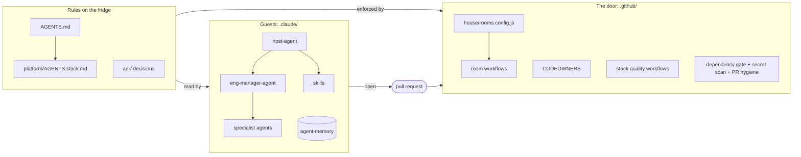
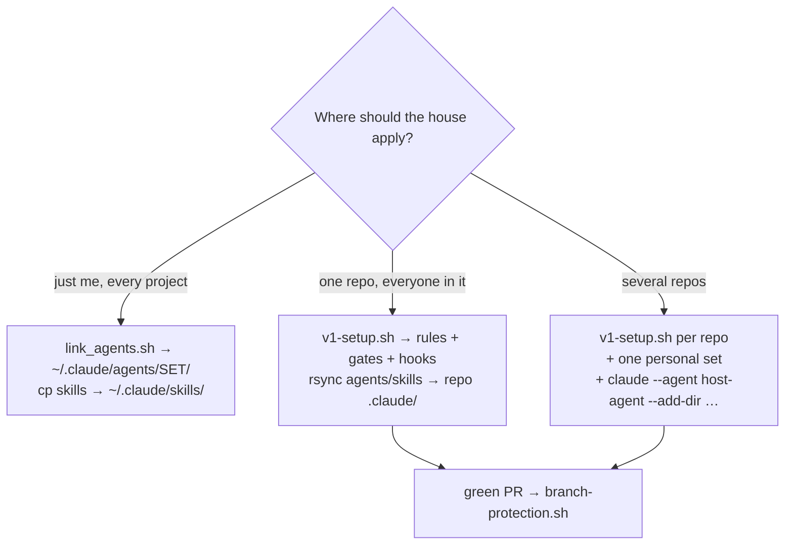
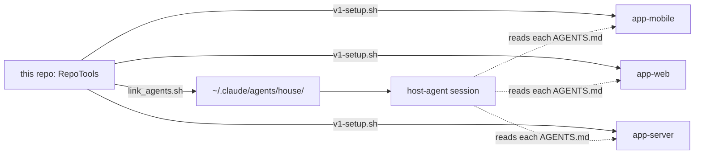
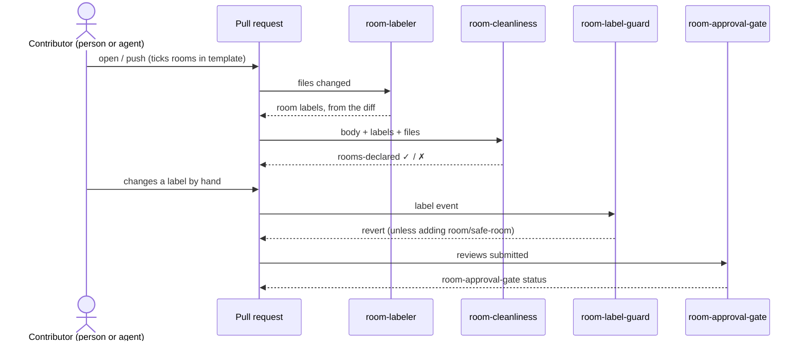
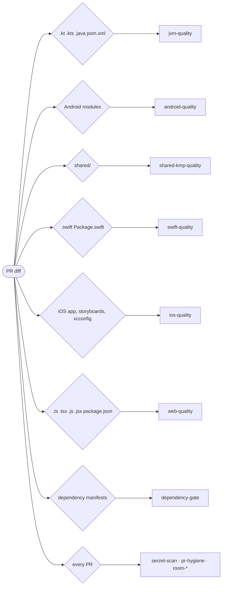
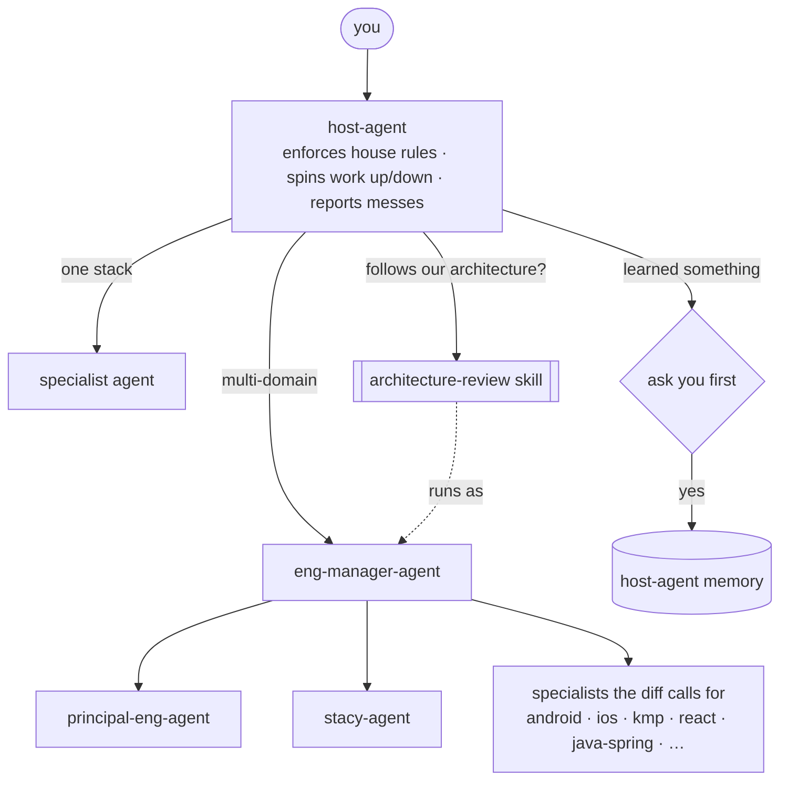
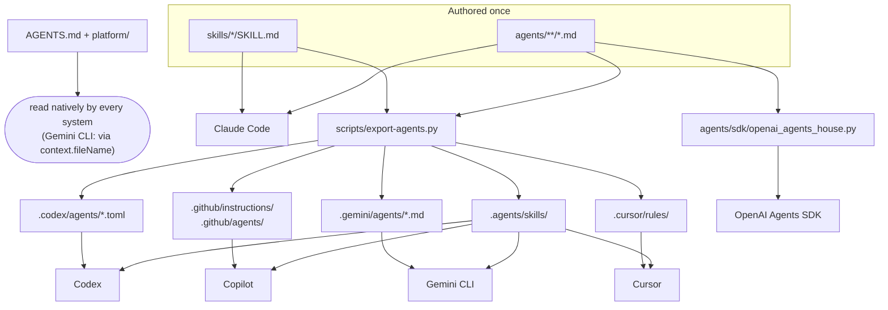

# House Rules — the file set from AI SLOP PARTY - https://bit.ly/ai_houseparty_slides

Everything promised on the last slide of *The AI Slop Party*, plus the agents,
skills and team memory that work inside it. Copy what you need; none of it is
clever, which is the point.

**The house is your codebase**, or the set of codebases everyone contributes to.
Rooms say how much damage a change can do. Gates make a PR prove it belongs in
the room it touches. Agents follow the same rules as the people.

**Website:** <https://childofthehorn.github.io/AI_HouseParty/> is these same
files, rendered. `docs/` holds only the shell (a layout, a stylesheet, one JS
file, a landing page); `.github/workflows/pages.yml` builds the site from the
markdown on every PR and deploys it from `main`.

## Contents

- [How it fits together](#how-it-fits-together)
- [Install](#install)
  - [Pick a target](#pick-a-target)
  - [A personal agent set](#a-personal-agent-set)
  - [One repository](#one-repository)
  - [A set of repositories](#a-set-of-repositories)
- [What's in the box](#whats-in-the-box)
- [The house map](#the-house-map)
- [Stacks](#stacks)
- [Room automation](#room-automation)
- [Quality gates](#quality-gates)
- [Agents and orchestration](#agents-and-orchestration)
- [Skills](#skills)
- [Team memory](#team-memory)
- [AI systems: instructions and limitations](#ai-systems-instructions-and-limitations)
  - [Which system reads what](#which-system-reads-what)
  - [Claude Code](#claude-code)
  - [OpenAI Codex](#openai-codex)
  - [OpenAI Agents SDK](#openai-agents-sdk)
  - [GitHub Copilot](#github-copilot)
  - [Cursor](#cursor)
  - [Gemini CLI](#gemini-cli)
  - [Limitations by system](#limitations-by-system)
- [Not done](#not-done)

## How it fits together



## Install

### Pick a target

| You want… | Do this | Gets you |
|---|---|---|
| the agents and skills everywhere you work | [A personal agent set](#a-personal-agent-set) | `~/.claude/agents/<set>/`, `~/.claude/skills/` |
| one repo to follow the house rules | [One repository](#one-repository) | rules, gates, hooks, labels, plus the agents in that repo's `.claude/` |
| the same house across several repos | [A set of repositories](#a-set-of-repositories) | each repo installed on its own, one personal set, and host-agent across them |
| a tool other than Claude Code | [AI systems](#ai-systems-instructions-and-limitations) | the same rules, skills and agents in that system's layout, and what it can't do |



### A personal agent set

Agents and skills for you, in every project. No repo changes.

```bash
./agents/link_agents.sh --list                    # the roster, by category
./agents/link_agents.sh house                     # symlink all 41 into ~/.claude/agents/house/
./agents/link_agents.sh --scan house ~/code/app   # or: pick agents for one project's stack
cp -R skills/architecture-review skills/smart-third-grader ~/.claude/skills/
claude --agent host-agent                         # start a session hosted by host-agent
```

The links point back into this repo, so `git pull` here updates the set. `--scan`
always includes `host-agent`, `stacy-agent`, `eng-manager-agent` and
`principal-eng-agent`, the bench that `architecture-review` needs.

Memory: `stacy-agent` and `host-agent` use `memory: project`, so they read and
write `.claude/agent-memory/<agent>/` **in the repo you are working in**. Copy
`.claude/agent-memory/stacy-agent/` into that repo to bring the team's lessons
along. If you want one memory for all projects, change the field to
`memory: user` and copy it to `~/.claude/agent-memory/` instead.

### One repository

Rules, gates and agents for everyone who works in one repo.

```bash
./scripts/v1-setup.sh ../your-app your-org        # rules, gates, hooks, labels
rsync -a --exclude README.md --exclude link_agents.sh agents/ ../your-app/.claude/agents/
cp -R skills/architecture-review skills/smart-third-grader ../your-app/.claude/skills/
cp -R .claude/agent-memory ../your-app/.claude/   # team memory (optional)
cp .claude/.gitignore ../your-app/.claude/        # keep machine-local files out of git
```

`v1-setup.sh` copies `AGENTS.md`, `platform/`, `adr/`, `.github/` (rooms, owners,
templates, workflows) and the configs, swaps `@your-org` for your handle,
installs the pre-commit hook and creates the labels. It installs **only the
quality workflows whose files exist** in the target (no `ios-quality` in a
Spring Boot repo). It deliberately does **not** touch branch protection.

Then, in order:

1. Read `ASSUMPTIONS.md`. Fix the module map in `AGENTS.md`, and delete the
   `platform/` files for stacks you don't have.
2. Put real handles in `.github/CODEOWNERS` and real logins in `teams`
   (`.github/house/rooms.config.js`).
3. Open a PR with just these files and let the workflows run. It's the cheapest
   way to find wrong check names.
4. Add a `SWEEP_TOKEN` secret (GitHub App) for the Driveway tow PR.
5. Once that PR is green, run `./scripts/branch-protection.sh OWNER/REPO main`
   (diff `gh api repos/OWNER/REPO/branches/main/protection` first).

<details><summary>By hand instead of v1-setup.sh</summary>

```bash
# 1. the door (fastest value, least argument)
cp -r .github/ /path/to/your/repo/.github/        # then delete the *-quality.yml you don't need
# edit CODEOWNERS and .github/house/rooms.config.js: real teams and paths

# 2. the local screen door
cp -r scripts/ /path/to/your/repo/scripts/
./scripts/install-hooks.sh

# 3. the deadbolt
./scripts/branch-protection.sh your-org/your-app main

# 4. the rules on the fridge
cp AGENTS.md /path/to/your/repo/
cp -r platform/ /path/to/your/repo/

# 5. coasters
cp -r adr/ /path/to/your/repo/
```

</details>

### A set of repositories

Each repo is its own house with its own `AGENTS.md`, rooms and owners. Install
each one as above, then work across them with a personal agent set:

```bash
for repo in ../app-mobile ../app-web ../app-server; do
  ./scripts/v1-setup.sh "$repo" your-org
done
./agents/link_agents.sh house                     # one personal set for all of them
claude --agent host-agent --add-dir ../app-web --add-dir ../app-server   # from ../app-mobile
```

host-agent reads each repo's own rules. When work crosses repos and the rules
differ, the stricter rule applies, and it says so. Keep the shared parts (the
platform files, the agents) in sync by re-running `v1-setup.sh` from this repo,
not by editing copies.



## What's in the box

```
AGENTS.md                              the rules on the fridge (generic)
platform/AGENTS.<stack>.md             additive rules: kotlin, android, kmp, swift, ios,
                                       java, spring, typescript, react (see platform/README.md)
ASSUMPTIONS.md                         every guess v1 makes, and how to verify it
PORTABILITY.md                         what Codex, the OpenAI Agents SDK, Copilot, Cursor and Gemini CLI read
STYLE-RULES-TO-FILL.md                 what is needed from your repo to specialise this
adr/                                   decision records (see adr/README.md)

.github/CODEOWNERS                     the door: required reviewers by blast radius
.github/pull_request_template.md       rooms (tick all that apply) + provenance
.github/labels.yml                     labels the workflows depend on
.github/house/rooms.config.js          the house map as code: rooms, Safe-room, approval rules
.github/house/house.js                 room logic shared by the room workflows (+ house.test.js)
.github/workflows/room-labeler.yml       labels PRs by the rooms their files touch
.github/workflows/room-cleanliness.yml   fails PRs that don't declare every touched room
.github/workflows/room-label-guard.yml   reverts human label changes, except adding Safe-room
.github/workflows/room-approval-gate.yml approvals by room and by file/directory path
.github/workflows/driveway-sweep.yml     weekly tow PR deleting expired Driveway files
.github/workflows/pr-hygiene.yml         provenance declared, size cap
.github/workflows/dependency-gate.yml    no uninvited plus-ones (Gradle, SPM, CocoaPods, Maven, npm)
.github/workflows/secret-scan.yml        gitleaks + mobile, web and JVM patterns
.github/workflows/jvm-quality.yml        Kotlin + Java + Spring: ./gradlew check (lint, static analysis, tests), house rules
.github/workflows/android-quality.yml    Android churn check, APK size
.github/workflows/shared-kmp-quality.yml no platform APIs in commonMain, iOS framework link
.github/workflows/swift-quality.yml      swiftformat, swiftlint, house rules, swift test (macOS + Linux)
.github/workflows/ios-quality.yml        thin SwiftUI views / UIKit controllers, no new storyboards, xcodebuild test
.github/workflows/web-quality.yml        JS/TS/React: lint, typecheck, format, tests, house rules, lockfile

scripts/v1-setup.sh                    install into a repo (quality workflows only for stacks present)
scripts/pre-commit                     local half of the door policy
scripts/install-hooks.sh               one command, no excuses
scripts/branch-protection.sh           branch protection as code
scripts/setup-labels.sh                create the labels in .github/labels.yml
scripts/collect-repo-context.sh        run in your repo; dumps stacks and config needed to specialise
scripts/export-agents.py               generate the other runtimes' layouts from agents/ and skills/ (--check)
scripts/build-site.sh                  assemble the website source from this markdown (GitHub runs Jekyll)
docs/                                  the website shell: _layouts/, assets/site.css, assets/site.js, index.md
.github/workflows/pages.yml              build the site on every PR, deploy it from main
.editorconfig  config/detekt/detekt.yml  .swiftformat  .swiftlint.yml  .gitleaks.toml

agents/                                41 agents by domain + link_agents.sh (see agents/README.md)
agents/sdk/openai_agents_house.py      OpenAI Agents SDK loader: builds Agent objects from agents/
skills/                                skills we wrote (see skills/README.md)
.claude/agents/  .claude/skills/       what Claude Code (and Copilot, Cursor) load in this repo
.agents/skills/                        generated: the cross-runtime skills dir (Codex, Copilot, Cursor, Gemini)
.codex/agents/  .gemini/agents/        generated: Codex TOML and Gemini CLI agents
.github/agents/  .github/instructions/ generated: Copilot agents and per-path rules
.cursor/rules/                         generated: Cursor per-path rules
.claude/agent-memory/                  stacy-agent (team) and host-agent memory; index in each MEMORY.md
```

## The house map

| Room | Contents | Gate |
|---|---|---|
| Kitchen | money, auth, regulated, shared contracts, DB migrations, dependency manifests, the gates themselves | two approvals (one senior), named human, no unsupervised agents |
| Living Room | core product, design system, web app, services | normal review, full CI |
| Garage | spikes, prototypes | go nuts; door stays shut; nothing ships from here |
| Driveway | scripts, dashboards, analyses | zero gates, mandatory expiry, towed at 90 days |
| **Safe-room** | cryptography, secure storage, key material — on top of its room | two senior approvals, one from security |

A PR can touch several rooms and must declare each one. Paths are mapped in
`.github/house/rooms.config.js` and mirrored in CODEOWNERS; keep them in step.
Why tiers, and why by blast radius: [ADR-0001](adr/0001-blast-radius-tiers.md).

## Stacks

The layout assumed is the conventional KMP one: `shared/` with
`commonMain`/`androidMain`/`iosMain`, `composeApp/` (or `androidApp/`) and
`iosApp/`. **Everything under `shared/` is Kitchen** - two platforms and a server
contract sit downstream of every change in it. The same house covers the code
around it: a web app (`webApp/`) and JVM services (`server/`).

| Stack | Rules | CI |
|---|---|---|
| Kotlin (any target) | `AGENTS.kotlin.md` | `jvm-quality` |
| Android, Jetpack Compose | + `AGENTS.android.md` | + `android-quality` (size) |
| KMP `shared/` | + `AGENTS.kmp.md` | + `shared-kmp-quality` |
| Swift (apps, packages, server, CLI) | `AGENTS.swift.md` | `swift-quality` |
| iOS apps, SwiftUI, UIKit | + `AGENTS.ios.md` | + `ios-quality` |
| Java | `AGENTS.java.md` | `jvm-quality` |
| Spring Boot (Java or Kotlin) | + `AGENTS.spring.md` | `jvm-quality` |
| JavaScript, TypeScript | `AGENTS.typescript.md` | `web-quality` |
| React | + `AGENTS.react.md` | `web-quality` |

Verify the map before you commit it:

```bash
./gradlew projects            # or: ./mvnw -q help:evaluate, package.json workspaces
bash scripts/collect-repo-context.sh
```

## Room automation

Every room workflow loads `.github/house/` from the PR's **base** commit and
never checks out PR code, so a PR cannot loosen its own rules.



| Workflow | Runs on | Does |
|---|---|---|
| `room-labeler.yml` | PR opened / pushed | labels `room/<room>` for every room touched; drops labels for rooms no longer touched; never removes Safe-room |
| `room-cleanliness.yml` | PR opened / pushed / edited / labeled | fails unless every touched room is ticked, Safe-room matches its label, and Driveway has a future `Expiry:` |
| `room-label-guard.yml` | label added / removed | reverts any label change by a person, except **adding** `room/safe-room` |
| `room-approval-gate.yml` | PR + reviews | `room-approval-gate` status: every matching rule must pass |
| `driveway-sweep.yml` | Mondays + manual (`dry_run`) | one `driveway/tow` PR deleting files from expired `room/driveway` PRs; never pushes to main |

**Approval rules** (`approvalRules`) match by room, by file/directory name, or
both. A plain name covers that file or everything under that directory
(`core/auth`); globs use `*`, `**`, `?`. Shipped examples: Kitchen, Safe-room,
Core modules (paths), and Dependencies (Gradle, SPM, CocoaPods, Maven and npm
manifests need one Platform approval — the dependency gate asks the questions,
the approval gate enforces it, so no human-applied label is needed).

**Driveway sweep:** each file's expiry comes from the latest merged Driveway PR
that touched it (`Expiry: YYYY-MM-DD`, or merge date + 90 days). A newer PR
renews the file. The tow PR gives two weeks to promote or renew. See
[ADR-0002](adr/0002-driveway-expiry.md) and [ADR-0003](adr/0003-room-labels-and-safe-room.md).

Test the logic: `node --test .github/house/house.test.js`.

### Before turning it on

1. Create the labels: `scripts/setup-labels.sh owner/repo`.
2. Replace the placeholder logins in `teams` and adjust room paths.
3. Run `scripts/branch-protection.sh`. It requires only checks that run on
   every PR: `gitleaks`, `mobile_specific`, `pr-hygiene`, `rooms-declared`,
   `room-approval-gate`. Path-filtered workflows never report when skipped, so
   requiring them would block unrelated PRs.
4. Allow Actions to create PRs, and add a `SWEEP_TOKEN` secret (GitHub App) so
   the tow PR triggers checks; add that App's bot login to `labelBots`.
5. On fork PRs the approval gate cannot post its status (read-only token).

## Quality gates

Each stack workflow runs only when its files change, checks out full history
(the diff checks need the merge base), and fails on house-rule violations in
**added lines only**, so existing code doesn't block a PR.



| Workflow | Blocks on (added lines, outside tests) |
|---|---|
| `jvm-quality` | `./gradlew check -x lint` or `./mvnw verify` (ktlint, detekt, Spotless, unit tests, as the build wires them); `@Suppress` / `@SuppressWarnings` without a reason, `System.out` / `printStackTrace`, field `@Autowired`, `runBlocking` (warning). `!!` and `GlobalScope` are detekt's job |
| `swift-quality` | swiftformat / swiftlint; force unwraps and casts, `@unchecked Sendable` without a reason, packages pinned to a branch or revision |
| `ios-quality` | networking or persistence in a View / ViewController, new storyboards or XIBs |
| `web-quality` | lint / typecheck / format / test scripts; `@ts-ignore`, `any`, file-wide or unexplained `eslint-disable`, dependency change without its lockfile, more than one lockfile |
| `dependency-gate` | inline Gradle coordinates; posts the five dependency questions for any new dependency |
| `secret-scan` | gitleaks, keys and tokens in source, tracked `.env`, signing material, literal `.npmrc` tokens |

`scripts/pre-commit` runs the fast local half of these before a commit.

## Agents and orchestration

`agents/` holds 41 agents in domain folders: engineering, product, design,
data, platform, and two people-shaped agents, `stacy-agent` (the house reviewer)
and `host-agent` (the house's enforcer and orchestrator). Claude Code loads the
identical copy in `.claude/agents/` whenever you work in this repo. Each agent
has a **House practices** section built from the team memory (the two
people-shaped agents read the memory directly instead), and the stack agents
point at their `platform/` rules and CI workflow.



Roster, install modes and sync rules: [`agents/README.md`](agents/README.md).

## Skills

`skills/` holds the skills we wrote; `.claude/skills/` is what Claude Code loads
here.

| Skill | Use it to |
|---|---|
| `architecture-review` | judge a PR, branch, path or proposal against the repo's architecture of record; eng-manager swarms principal, stacy and the right specialists; returns FOLLOWS / FOLLOWS WITH NOTES / ESCALATE |
| `smart-third-grader` | rewrite a reply in short, plain, correct sentences; also the house voice for code comments |

Install and add skills: [`skills/README.md`](skills/README.md).

## Team memory

| Memory | Holds | Written by |
|---|---|---|
| `.claude/agent-memory/stacy-agent/` | team lessons learned the hard way: verify against `origin/main`, enumerate before claiming "zero", tests must call the changed function, lint enforcement drifts per repo, and more | `stacy-agent`; the agents' House practices are built from it |
| `.claude/agent-memory/host-agent/` | host-agent's own lessons, each one approved by a person before it was written | `host-agent`, only after asking |
| `.claude/agent-memory-local/` | machine-local working memory (host-agent's `WORKING.md`) | ignored by git |

`MEMORY.md` is the index in each folder. Machine-local Claude files are ignored
by `.claude/.gitignore`.

## AI systems: instructions and limitations

The house is written once. `AGENTS.md` and the platform rules are plain markdown
every system reads. The agents and skills are authored in Claude Code's format
and **generated** into each other system's layout by `scripts/export-agents.py`
(`--check` fails if a copy is stale). Nothing is hand-maintained twice.

### Which system reads what



| System | Rules | Per-path rules | Skills | Agents | Memory |
|---|---|---|---|---|---|
| Claude Code | `AGENTS.md` (via CLAUDE.md or `@AGENTS.md`) | agent reads the platform file the table names | `.claude/skills/` | `.claude/agents/` | `.claude/agent-memory/` auto-loaded |
| OpenAI Codex | `AGENTS.md` natively (root → cwd, 32 KiB cap) | same as above | `.agents/skills/` | `.codex/agents/*.toml` | folder read on instruction |
| OpenAI Agents SDK | you pass `AGENTS.md` text as context | n/a | n/a | `Agent` objects from `agents/` | folder read on instruction |
| GitHub Copilot | `AGENTS.md` natively | `.github/instructions/*.instructions.md` (`applyTo`) | `.agents/skills/` or `.claude/skills/` | `.claude/agents/` or `.github/agents/*.agent.md` | folder read on instruction |
| Cursor | `AGENTS.md` natively | `.cursor/rules/*.mdc` (`globs`) | `.agents/skills/` or `.claude/skills/` | `.claude/agents/` or `.cursor/agents/` | folder read on instruction |
| Gemini CLI | `AGENTS.md` via `context.fileName` | nested `GEMINI.md` only | `.agents/skills/` | `.gemini/agents/*.md` | folder read on instruction |

### Claude Code

The source format. Everything in [Install](#install) is written for it.

```bash
./agents/link_agents.sh house && cp -R skills/* ~/.claude/skills/   # personal
claude --agent host-agent                                           # hosted session
```

Limits: subagents nest three layers below the main session (so run `host-agent`
as the main session, not as a subagent); `memory: project` only works while auto
memory is on; `tools:` allowlists are honored only here and in the SDK loader.

### OpenAI Codex

```bash
# in your repo
cp -R .agents ../your-app/          # skills: .agents/skills/<name>/SKILL.md
cp -R .codex  ../your-app/          # agents: .codex/agents/<name>.toml (trusted projects only)
# or personal
mkdir -p ~/.agents/skills ~/.codex/agents
cp -R .agents/skills/* ~/.agents/skills/ && cp .codex/agents/*.toml ~/.codex/agents/
```

Codex reads `AGENTS.md` from the git root down to the working directory, one
file per directory, and concatenates them up to 32 KiB. Invoke a skill with
`/skills` or `$architecture-review`. A parent agent spawns ours with
`spawn_agent` / `wait_agent` (multi-agent is on by default).

Limits: `tools:` is ignored (agents inherit the parent sandbox); whether a Codex
subagent can spawn its own is not documented, so `eng-manager-agent` returns the
dispatch briefs if it cannot; project `.codex/` config loads only for trusted
projects.

### OpenAI Agents SDK

No files to install. `agents/sdk/openai_agents_house.py` reads `agents/**/*.md`
at runtime and returns `Agent` objects. `host-agent` and `eng-manager-agent` get
the others through `agent.as_tool()`, so the manager keeps control, which is how
they are written. You supply function tools per capability; the Claude tool
names map onto `read`, `write`, `shell`, `web`.

```bash
pip install openai-agents                 # in your project, not here
python3 agents/sdk/openai_agents_house.py # prints the roster and each agent's capabilities
```

```python
import sys; sys.path.append("path/to/RepoTools/agents/sdk")
from openai_agents_house import load_house
from agents import Runner
house = load_house(tools={"read": [read_file], "shell": [run_shell]}, model="gpt-5")
print(Runner.run_sync(house["host-agent"], "Review PR 123 against our architecture.").final_output)
```

Limits: skills don't exist in the SDK (paste `skills/architecture-review/SKILL.md`
as the prompt instead); `AGENTS.md` isn't read by anything, so pass it as
context; the house gates (`.github/`) still run on whatever the agents commit.

### GitHub Copilot

```bash
./scripts/v1-setup.sh ../your-app your-org                  # carries .github/instructions/ for the stacks present
WITH_COPILOT_AGENTS=1 ./scripts/v1-setup.sh ../your-app your-org   # also .github/agents/*.agent.md
rsync -a --exclude README.md --exclude link_agents.sh --exclude sdk agents/ ../your-app/.claude/agents/   # Copilot reads these too
```

Copilot reads `AGENTS.md` (nearest wins), `.claude/agents/` and `.claude/skills/`
directly, `.agents/skills/`, `.github/agents/*.agent.md`, and auto-attaches
`.github/instructions/*.instructions.md` by `applyTo` glob. Custom agents call
others through the `agent` tool in VS Code.

Limits: agent prompts are capped at 30,000 characters, so seven long agents ship
as a short form that tells the agent to read the full file; `tools:` is ignored
(defaults to all); the cloud coding agent ignores `handoffs`; path-specific
instructions on GitHub.com apply only to the cloud agent and code review.

### Cursor

```bash
./scripts/v1-setup.sh ../your-app your-org                  # carries .cursor/rules/*.mdc for the stacks present
rsync -a --exclude README.md --exclude link_agents.sh --exclude sdk agents/ ../your-app/.claude/agents/
cp -R skills/* ../your-app/.claude/skills/
```

Cursor reads `AGENTS.md` (root and subdirectories), `.claude/agents/`,
`.claude/skills/`, `.agents/skills/` and `.cursor/rules/*.mdc` (auto-attached by
`globs`). Nothing else is needed.

Limits: subagents inherit all tools (`tools:` and read-only hints are ignored);
subagents nest two levels, so a specialist launched by `eng-manager-agent`
cannot launch further; `.mdc` is required, a plain `.md` in `.cursor/rules` is
ignored.

### Gemini CLI

```bash
cp -R .agents .gemini ../your-app/
# .gemini/settings.json in the repo (or ~/.gemini/settings.json):
#   { "context": { "fileName": ["AGENTS.md", "GEMINI.md"] } }
```

Gemini reads `AGENTS.md` once `context.fileName` names it, skills from
`.agents/skills/` (activated with a consent prompt), agents from
`.gemini/agents/*.md`.

Limits: **subagents cannot call other subagents.** `eng-manager-agent` and
`architecture-review` detect this, do the core lenses themselves, and mark the
report single-reviewer. `host-agent` can still delegate one level. `tools:` is
omitted in the export so agents inherit everything; per-path rules are nested
`GEMINI.md` files only, no globs.

### Limitations by system

| | Claude Code | Codex | Agents SDK | Copilot | Cursor | Gemini CLI |
|---|---|---|---|---|---|---|
| Reads `AGENTS.md` without setup | via CLAUDE.md | yes | no (pass as context) | yes | yes | needs `context.fileName` |
| Per-path rules by glob | no (agent reads the file) | no | n/a | yes | yes | no |
| Honors `tools:` allowlist | yes | no | mapped to capabilities | no | no | no |
| Agent memory auto-loaded | yes | read on instruction | read on instruction | read on instruction | read on instruction | read on instruction |
| Subagent nesting | 3 layers | 1 confirmed | unlimited (your code) | yes (VS Code) | 2 levels | none |
| Skill frontmatter | all fields | spec fields | n/a | spec + a few Claude fields | spec + a few | spec fields |
| Agent prompt size cap | none documented | none documented | model context | 30,000 chars | none documented | none documented |
| `architecture-review` runs as designed | yes | yes, if subagents can spawn | yes | yes (VS Code) | yes, specialists can't nest | single-reviewer |
| `host-agent` as main session | `claude --agent host-agent` | load the TOML's instructions | `house["host-agent"]` | select the agent | select the agent | select the agent |

Facts above come from each system's official docs on 2026-10-04 and are cited in
[`PORTABILITY.md`](PORTABILITY.md), which also lists what was *unconfirmed*. None
of the non-Claude layouts has been smoke-tested in a live session yet; the files
parse and follow the documented formats.

## Not done

Every `FILL IN` marker needs your repo. `STYLE-RULES-TO-FILL.md` lists exactly
what to send — the ruleset configs and a couple of repeated review comments —
and those become the sections that make this yours rather than generic.
