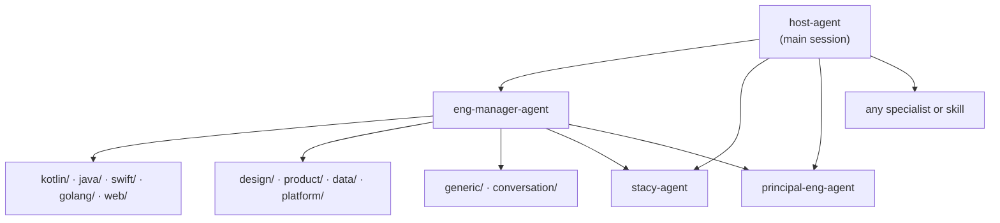
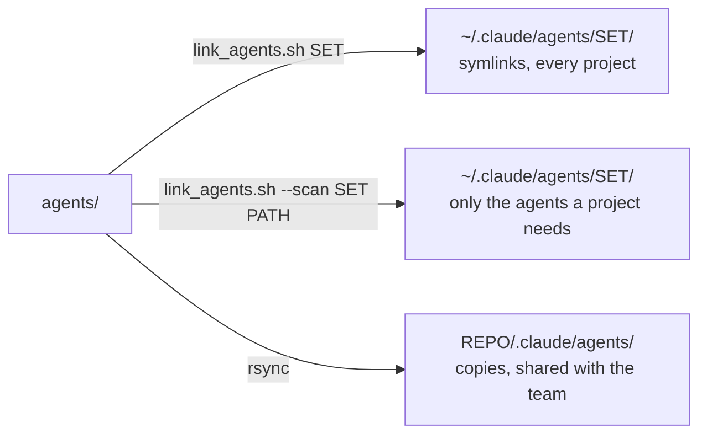

# Agents

41 Claude Code agents, grouped by domain. This folder is the browsable,
installable copy of `.claude/agents/`, which Claude Code loads automatically when
you work in this repo. The two must stay identical (see [Keeping the copies in
sync](#keeping-the-copies-in-sync)).

## Contents

- [How they work together](#how-they-work-together)
- [Roster](#roster)
- [Stack agents and their house rules](#stack-agents-and-their-house-rules)
- [House practices](#house-practices)
- [Memory](#memory)
- [Install](#install)
  - [A personal agent set](#a-personal-agent-set)
  - [One repository](#one-repository)
  - [A set of repositories](#a-set-of-repositories)
- [Adding an agent](#adding-an-agent)
- [Keeping the copies in sync](#keeping-the-copies-in-sync)
- [Other runtimes](#other-runtimes)

## How they work together

`host-agent` hosts: it holds the house rules and decides who handles what.
`eng-manager-agent` decomposes multi-domain work and launches the specialists.
Subagents can nest three layers below the main session, so run host-agent as
the main session (`claude --agent host-agent`) to leave room for the layers.



## Roster

| Folder | Agent | Use it for |
|---|---|---|
| `person/` | `stacy-agent` | Code review, building, and pattern calls in Stacy Devino's voice; the house reviewer persona |
| | `host-agent` | The house's host: enforces the house rules, delegates to any agent or skill, spins work up and down, reports messes, self-evolves only with your approval |
| `conversation/` | `principal-eng-agent` | Architecture and senior code review; simplify, reuse, prefer proven patterns |
| | `career-eng-agent` | Staff+ career paths, leveling, promotion cases |
| `generic/` | `eng-manager-agent` | Orchestrating several specialists on one task; launches them itself (`Agent` tool); runs `architecture-review` |
| | `dir-eng-agent` | Engineering-org health, delivery, quality gates |
| | `gradle-agent` | Gradle, Kotlin DSL, version catalogs, convention plugins, build speed |
| | `market-research-agent` | Competitors, pricing, positioning, market signals |
| | `user-researcher-agent` | Behavior, motivation, friction, gamification |
| `kotlin/` | `android-agent` | Android with Compose and KMP-style architecture; ART/AOSP internals |
| | `kmp-agent` | Kotlin Multiplatform: `commonMain`, expect/actual |
| | `cmp-agent` | Compose Multiplatform UI across Android, iOS, desktop, web |
| | `kotlin-agent` | Idiomatic Kotlin and Kotlin-first dependencies |
| | `kotlin-springboot-agent` | Kotlin + Spring Boot services |
| `java/` | `java-spring-agent` | Java + Spring Boot services |
| `swift/` | `ios-agent` | iOS apps across Swift, Objective-C, and legacy code |
| | `swift-agent` | Swift language, SwiftPM, testing, version migrations |
| `golang/` | `golang-agent` | Idiomatic, standard-library-first Go |
| `web/` | `frontend-web-agent` | Frontend work that crosses design, a11y, performance, tooling |
| | `javascript-web-agent` | Browser JS/TS and Web APIs |
| | `javascript-runtime-agent` | Node, Deno, Bun, edge runtimes |
| | `react-web-agent` | React and React meta-frameworks |
| `design/` | `mobile-design-agent` | iOS HIG + Material design decisions |
| | `web-design-agent` | Responsive web layout and typography |
| | `accessibility-agent` | Accessibility audits (HIG, Android, WCAG 2.1 AA) |
| | `dir-design-agent` | Design-system health and design leadership |
| `product/` | `mobile-product-agent` | Mobile product scope and platform trade-offs |
| | `backend-product-agent` | API and service-boundary product decisions |
| | `customer-product-agent` | Customer-experience-led product shaping |
| | `dir-product-agent` | Product-org health and roadmap coherence |
| `data/` | `googleanalytics-agent` | GA4 / Firebase Analytics instrumentation |
| | `airflow-agent` | Airflow DAGs and operators |
| | `airtable-agent` | Airtable schema, formulas, automations, API |
| | `snowflake-insights-agent` | Snowflake ingestion, modeling, cost |
| | `snowflake-data-agent` | Snowflake Cortex and in-platform AI |
| `platform/` | `aws-agent` | AWS architecture and IAM |
| | `gcp-agent` | GCP infrastructure |
| | `google-api-agent` | Google Cloud and Workspace APIs |
| | `kubernetes-agent` | Kubernetes on EKS |
| | `terraform-agent` | Terraform / OpenTofu |
| | `docker-agent` | Dockerfiles, Compose, image builds |

## Stack agents and their house rules

Each stack agent's House practices names the `platform/` rules it follows and
the CI workflow that checks its work.

| Agent | Rules (`platform/`) | CI |
|---|---|---|
| `kotlin-agent` | `AGENTS.kotlin.md` | `jvm-quality` |
| `android-agent` | `AGENTS.kotlin.md` + `AGENTS.android.md` | `jvm-quality` + `android-quality` |
| `kmp-agent`, `cmp-agent` | `AGENTS.kotlin.md` + `AGENTS.kmp.md` | `jvm-quality` + `shared-kmp-quality` |
| `kotlin-springboot-agent` | `AGENTS.kotlin.md` + `AGENTS.spring.md` | `jvm-quality` |
| `java-spring-agent` | `AGENTS.java.md` + `AGENTS.spring.md` | `jvm-quality` |
| `gradle-agent` | Gradle rules in `AGENTS.kotlin.md`, build rules in `AGENTS.java.md` | `jvm-quality`, `android-quality`, `shared-kmp-quality` |
| `swift-agent` | `AGENTS.swift.md` | `swift-quality` |
| `ios-agent` | `AGENTS.swift.md` + `AGENTS.ios.md` | `swift-quality` + `ios-quality` |
| `javascript-web-agent`, `javascript-runtime-agent` | `AGENTS.typescript.md` | `web-quality` |
| `react-web-agent`, `frontend-web-agent` | `AGENTS.typescript.md` + `AGENTS.react.md` | `web-quality` |

## House practices

Every agent except `stacy-agent` and `host-agent` ends with a **House practices
(team memory, 2026-10)** section; those two read the source directly. It has three layers:

1. **Evidence, for every agent.** Check repo state against `origin/main`, list
   every hit before claiming "zero X", stay in scope, verify before "done",
   treat pasted secrets as compromised, follow the rooms in `AGENTS.md` and the
   `platform/` files for each stack in the diff.
2. **Code, for agents that write or review it.** No speculative refactors, no
   defensive code or leftover noise, load-bearing comments only, tests that
   call the changed function, commit only when asked.
3. **Domain notes,** e.g. lint enforcement drift and multiplatform-first
   helpers for the Kotlin agents, cross-platform parity for iOS and design,
   ticket workflow for product, and each stack agent's rules and CI.

`stacy-agent` carries the same lessons in its working-style defaults. When a
lesson changes, update the memory first, then the agents that cite it.

## Memory

| Agent | `memory:` | Directory | Writes |
|---|---|---|---|
| `stacy-agent` | `project` | `.claude/agent-memory/stacy-agent/` | team lessons, as it learns them |
| `host-agent` | `project` | `.claude/agent-memory/host-agent/` | its own lessons, **only after you approve** each one (learning, evidence, why, exact change) |

`project` memory lives in the repo you are working in. host-agent's working
memory for the current effort is machine-local:
`.claude/agent-memory-local/host-agent/WORKING.md`, ignored by git.

## Install



### A personal agent set

```bash
./agents/link_agents.sh --list                 # show the roster
./agents/link_agents.sh house                  # symlink all into ~/.claude/agents/house/
./agents/link_agents.sh --scan house ~/code/app  # pick agents for a project's stack
claude --agent host-agent                      # start a hosted session
```

Links point back into this repo, so `git pull` here updates every set. `--scan`
detects the project's stacks, recommends the matching agents plus a bench
(`host-agent`, `stacy-agent`, `eng-manager-agent`, `principal-eng-agent`,
product and research), asks before linking, and writes a `SYSTEM.md` in the set
recording the choices. It runs on the stock macOS bash 3.2.

The script finds agents in the category folders next to it, so this README is
never linked. If `~/.claude/agents/` already has another copy of these agents,
remove it first or every agent shows up twice.

### One repository

Copy, don't link, so everyone who clones the repo gets the same agents:

```bash
rsync -a --exclude README.md --exclude link_agents.sh --exclude sdk agents/ ../your-app/.claude/agents/
cp -R .claude/agent-memory ../your-app/.claude/   # team memory, optional
```

Never put a README in `.claude/agents/`: Claude Code reads every `.md` file
there as an agent definition.

### A set of repositories

Use one personal set (above), and start host-agent from one repo with the others
added: `claude --agent host-agent --add-dir ../other-repo`. Each repo's own
`AGENTS.md` still governs that repo. To give each repo a shared copy instead,
repeat the rsync per repo.

## Adding an agent

1. Put it in the matching category folder with standard frontmatter (`name`,
   `description`, `tools`). If it delegates, include `Agent` in `tools`.
2. Add a House practices section built from `.claude/agent-memory/stacy-agent/`,
   plus its `platform/` rules if it is a stack agent.
3. Add a row to the roster above and to `eng-manager-agent`'s roster, then sync
   the copies.

## Keeping the copies in sync

Edit one copy, then mirror it:

```bash
rsync -a --delete --exclude README.md --exclude link_agents.sh --exclude sdk agents/ .claude/agents/
diff -r -x README.md -x link_agents.sh -x sdk -x .DS_Store agents .claude/agents   # must print nothing
scripts/export-agents.py && scripts/export-agents.py --check                   # regenerate the other runtimes
```

## Other runtimes

Copilot and Cursor read `.claude/agents/` directly. For Codex (`.codex/agents/*.toml`),
Gemini CLI (`.gemini/agents/*.md`) and Copilot's own `.github/agents/*.agent.md`,
run `scripts/export-agents.py`; the outputs are generated from this folder and
checked in. `sdk/openai_agents_house.py` builds OpenAI Agents SDK agents from the
same files at runtime (`python3 agents/sdk/openai_agents_house.py` prints the
roster with each agent's capabilities). What each runtime honors, and what it
ignores (`tools:`, `memory:`), is in [`PORTABILITY.md`](../PORTABILITY.md).
