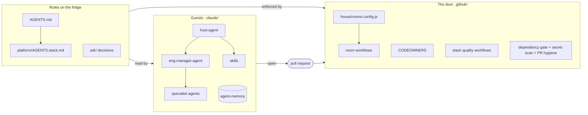

<section class="hero">
  

    <h1>House Rules</h1>
    
Shoes off. Apron on.

    <ul>
      <li>The game is <strong>your product</strong>.</li>
      <li>The TV is <strong>GitHub</strong>.</li>
      <li>The food and drink is <strong>the AI</strong>.</li>
    </ul>
  

  
</section>

The house is your codebase, or every codebase your team contributes to. Rooms
say how much damage a change can do. Gates make a PR prove it belongs in the
room it touches. Agents follow the same rules as the people. This site is the
repository's own markdown, rendered; the [README](README.md) has every command.

## The house

<figure class="figure">
  
</figure>

Every path in the repo lives in a room. The room sets the gate.

  <article class="room room--kitchen">
    
<h3>Kitchen</h3>

    

Money paths. Auth. Anything regulated.

No unsupervised guests. Ever. Two-key changes.

  </article>
  <article class="room room--living-room">
    
<h3>Living Room</h3>

    

Core product. The game's on in here.

Normal review, normal gates. Everybody sees it break.

  </article>
  <article class="room room--garage">
    
<h3>Garage</h3>

    

Prototypes, spikes, weird ideas. Go nuts.

One rule: the garage door stays shut.

  </article>
  <article class="room room--driveway">
    
<h3>Driveway</h3>

    

Dashboards, scripts, Thursday's analysis.

Zero gates. Mandatory expiry. 90 days, then it gets towed.

  </article>
  <article class="room room--safe-room">
    
<h3>Safe-room</h3>

    

Cryptography, secure storage, key material. It sits on top of whatever room the path is already in.

Two senior approvals, one from security.

  </article>

A PR can touch several rooms and must tick every one. Automation labels the
rooms from the diff, so nobody argues about it. Why tiers, and why by blast
radius: [ADR-0001](adr/0001-blast-radius-tiers.md).

## The door policy

### Rules on the fridge

Short, generic, read before you cook: [AGENTS.md](AGENTS.md), plus one page of
[platform rules](platform/README.md) per stack.

### The door

CODEOWNERS, the dependency gate and the room workflows read the base commit, so
a PR cannot loosen its own rules: [room automation](README.md#room-automation)
and [quality gates](README.md#quality-gates).

### Coasters

Every rule stands on a [decision](adr/README.md) that says why, so nobody has to
relitigate it at the party.

## Reading the room

<figure>
  
</figure>

The guests read the fridge before they touch anything. [41 agents](agents/README.md)
by domain, hosted by `host-agent` and orchestrated by `eng-manager-agent`.
[Skills](skills/README.md) such as `architecture-review` give them a procedure to
follow. Each agent carries a House practices section built from team memory, so
the mistakes made here once stay made once.

## How it fits together

## Take the files home

Read [Assumptions](ASSUMPTIONS.md) first. It lists every guess v1 makes about
your repo and how to check each one; only you know where your Kitchen is.

| You want… | Start with | Then read |
|---|---|---|
| the agents and skills everywhere you work | [A personal agent set](README.md#a-personal-agent-set) | [Agents](agents/README.md), [Skills](skills/README.md) |
| one repo to follow the house rules | [One repository](README.md#one-repository) | [House rules](AGENTS.md), [Platform rules](platform/README.md) |
| the same house across several repos | [A set of repositories](README.md#a-set-of-repositories) | [Decisions](adr/README.md), [Agents](agents/README.md) |
| a tool other than Claude Code | [Other AI systems](PORTABILITY.md) | [Which system reads what](README.md#which-system-reads-what) |
