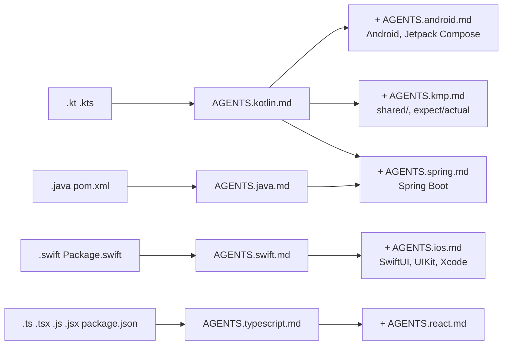

# Platform rules

Additive to the root `AGENTS.md`. A diff usually needs a **language** file plus
a **target** file. The root `AGENTS.md` table maps paths to files; this is the
same map as a picture.

## Contents

- [Which files apply](#which-files-apply)
- [Files](#files)
- [Shape of every file](#shape-of-every-file)

## Which files apply

## Files

| File | Covers | CI that checks it |
|---|---|---|
| [`AGENTS.kotlin.md`](AGENTS.kotlin.md) | Kotlin on any target: nullability, coroutines, types, Gradle, tests | `jvm-quality` |
| [`AGENTS.android.md`](AGENTS.android.md) | Android and Jetpack Compose: state hoisting, lifecycle, design tokens, navigation | `jvm-quality` + `android-quality` |
| [`AGENTS.kmp.md`](AGENTS.kmp.md) | `shared/`: no platform APIs in `commonMain`, expect/actual pairs, wire contracts | `shared-kmp-quality` |
| [`AGENTS.swift.md`](AGENTS.swift.md) | Swift on any target: unwraps, concurrency, SPM, server and CLI Swift, tests | `swift-quality` |
| [`AGENTS.ios.md`](AGENTS.ios.md) | iOS apps: SwiftUI, UIKit, Xcode project | `ios-quality` |
| [`AGENTS.java.md`](AGENTS.java.md) | Java: records, nulls, exceptions, logging, Gradle/Maven, tests | `jvm-quality` |
| [`AGENTS.spring.md`](AGENTS.spring.md) | Spring Boot in Java or Kotlin: injection, thin controllers, DTOs, transactions, migrations | `jvm-quality` |
| [`AGENTS.typescript.md`](AGENTS.typescript.md) | TypeScript and JavaScript, browser and Node: strictness, `any`, boundaries, lockfiles | `web-quality` |
| [`AGENTS.react.md`](AGENTS.react.md) | React: components render, hooks rules, effects, data layer, a11y | `web-quality` |

## Shape of every file

Each file has the same sections, so an agent knows where to look:

1. **Build and check**: the exact commands to run before saying "done".
2. **Rules**: the stack's non-negotiables, each one short.
3. **Testing**: the frameworks, plus the rule that a bug fix lands with a test
   that fails before the fix.
4. **Anti-patterns seen in this repo**: `FILL IN` from your own review
   comments. See `STYLE-RULES-TO-FILL.md`.

Delete the files for stacks your repo doesn't have.
