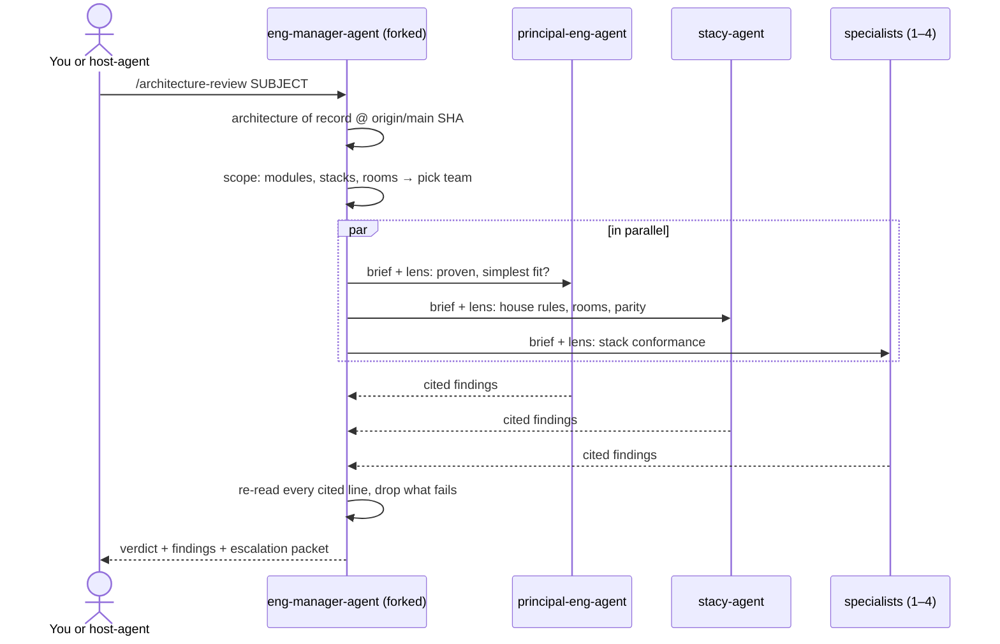

# Skills

Claude Code skills we wrote. Each one is a folder with a `SKILL.md`. Claude
loads a skill when a request matches its `description`, or when you type
`/<skill-name>`.

## Contents

- [Skills in this set](#skills-in-this-set)
- [How architecture-review runs](#how-architecture-review-runs)
- [Install](#install)
- [Adding a skill](#adding-a-skill)

## Skills in this set

| Skill | What it does | Invoke |
|---|---|---|
| `architecture-review` | Judges a PR, branch, path or proposal against the repo's architecture of record: `ARCHITECTURE.md`, accepted ADRs, `AGENTS.md` + `platform/` rules, and the architecture the code defines (module graph, dependency direction, layering, wire contracts). Runs as `eng-manager-agent`, which swarms `principal-eng-agent`, `stacy-agent` and the specialists the diff calls for, verifies every finding, and returns FOLLOWS / FOLLOWS WITH NOTES / ESCALATE with an escalation packet. Read-only. | `/architecture-review 123` (PR), a branch, a path, or "does this follow our architecture?" |
| `smart-third-grader` | Rewrites a reply in the voice of a bright 8-year-old: short sentences, plain words, ideas kept correct. Also the house voice for code comments (see the comment-and-test-polish memory). | "explain like a smart third grader" |

`skills/` is the source. `.claude/skills/` is the identical copy Claude Code
(and Copilot, Cursor) load in this repo. `.agents/skills/` is generated by
`scripts/export-agents.py` with spec-only frontmatter for Codex, Copilot, Cursor
and Gemini CLI; outside Claude Code the Claude-only fields (`context: fork`,
`agent:`, `background:`, `argument-hint:`) are dropped and the skill body says
how to run without them.

## How architecture-review runs

A finding counts only if it cites both the code (`file:line`) and the rule it
is judged against. A rule is either written (`ARCHITECTURE.md`, an ADR,
`AGENTS.md`) or "established" (the same pattern in two or more places on
`origin/main`). With no written architecture, the report says so and labels
every rule **inferred**.

## Install

| Target | Command |
|---|---|
| personal (every project) | `cp -R skills/architecture-review skills/smart-third-grader ~/.claude/skills/` |
| one repository | `cp -R skills/architecture-review skills/smart-third-grader ../your-app/.claude/skills/` |
| a set of repositories | install once personally, or repeat the repo copy per repo |
| Codex, Gemini CLI, or any Agent Skills runtime | `cp -R .agents ../your-app/` (or `~/.agents/skills/` for a personal install) |

`architecture-review` needs the agents it calls installed in the same scope:
`eng-manager-agent` (with the `Agent` tool, as shipped here),
`principal-eng-agent`, `stacy-agent` and the specialists (see
[`agents/README.md`](../agents/README.md)). It uses `context: fork` +
`agent: eng-manager-agent` + `background: false`, so the review runs as
eng-manager and you wait for the verdict.

## Adding a skill

1. Create `skills/<name>/SKILL.md` with `name` and `description` frontmatter.
   The description is the trigger, so list the phrases that should load it.
2. Copy the folder to `.claude/skills/<name>/` and add a row above.
3. Keep the copies identical: `diff -r skills/<name> .claude/skills/<name>`, then
   `scripts/export-agents.py` to regenerate `.agents/skills/<name>`.
